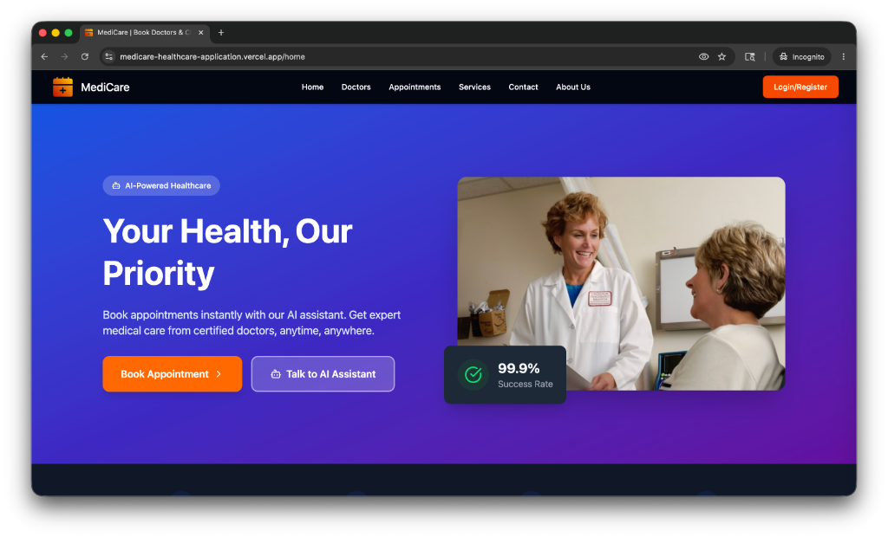
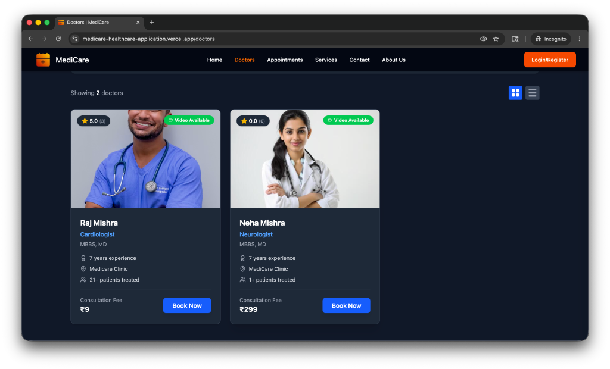
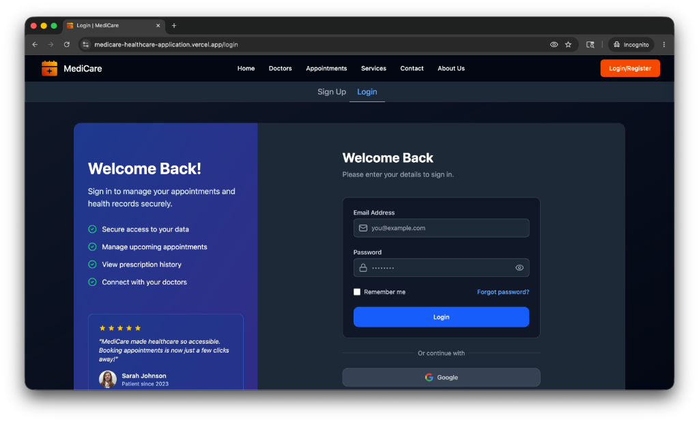
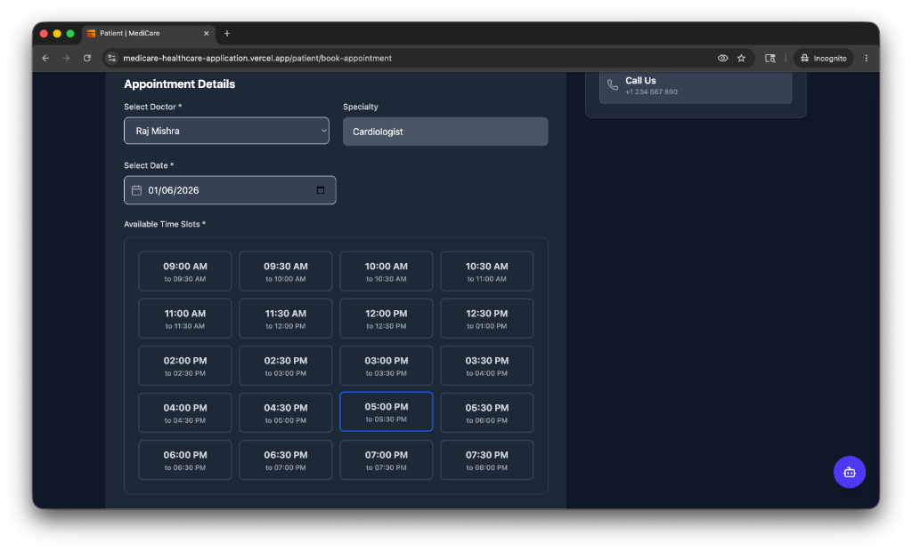
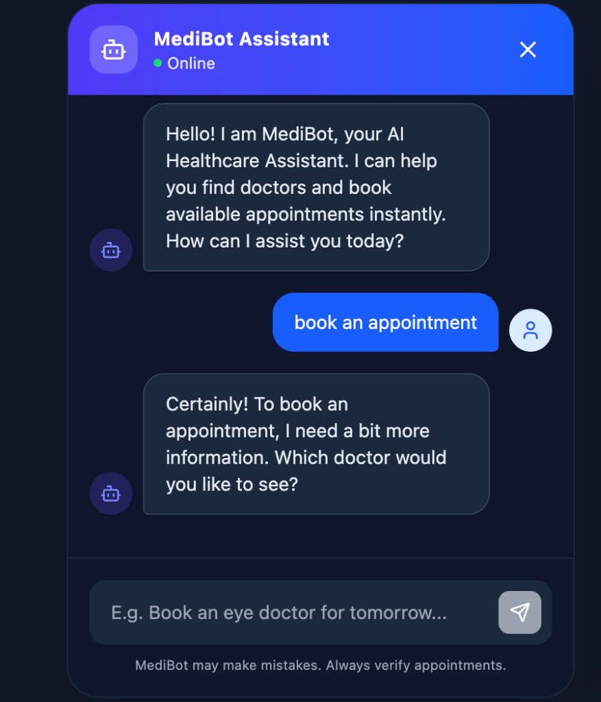

# 🏥 Doctor Appointment Management System

A comprehensive full-stack healthcare application built with **Node.js**, **Express**, **React**, and **MongoDB**. This system enables patients to book appointments with doctors, manage medical records, and access an intelligent AI-powered assistant for healthcare guidance. The platform provides seamless appointment management, real-time updates, and secure payments, all enhanced by our advanced **MediBot** assistant.

---

## 🌐 Live Deployment

The application is deployed and running live on:

- **Frontend**: https://medicare-healthcare-application.vercel.app
- **Backend API**: https://medicare-healthcare-app.onrender.com

---

## 🎬 User Flow Screenshots

Here is a visual preview of the Patient and AI Agent experience on MediCare:

### 1. Hero & Dynamic Home Page
An elegant, modern home page highlighting real-time dynamic doctor statistics, patient counts, average ratings, and direct pathways to the AI Assistant.


### 2. Verified Doctors Directory
Search and filter on-staff medical experts dynamically by specialty, ratings, experience, and consultation fees.


### 3. Patient Authentication Portal
Secure access to patients and doctors with JWT token refresh flows and role-based route protection.


### 4. Interactive Time Slot Booking
Guided, timezone-aware appointment scheduler showing available slots in Indian Standard Time (IST) for seamless booking.


### 5. Persistent MediBot Chat Assistant
A persistent, context-aware AI chatbot widget that follows the patient across pages to assist with doctor discovery and step-by-step slot bookings in real-time.


---

## ✨ Key Features

### 👨‍⚕️ For Patients
- Browse and search doctors by specialty, ratings, and availability
- Book, reschedule, and cancel appointments
- Real-time appointment status updates
- Secure payment integration with Razorpay
- Medical records and prescription management
- Video/audio consultation support (Socket.io)
- Rate and review doctors
- **🤖 24/7 AI-Powered MediBot Assistant** - Intelligent healthcare companion for:
  - Finding the right doctor based on symptoms and concerns
  - Booking appointments seamlessly with personalized recommendations
  - Medical consultation queries and symptom analysis
  - Health tips and preventive care guidance
  - Treatment recommendations and health education

### 👨‍💼 For Doctors
- Complete profile management with credentials
- Manage appointment slots and availability
- View and manage patient appointments
- Prescribe medications and upload medical records
- Track patient reviews and ratings
- Real-time notifications for new bookings
- Performance analytics and dashboard

### 🔐 For Admins
- User and doctor verification system
- Suspend/deactivate accounts
- View system-wide analytics and statistics
- Manage platform content and policies
- Monitor transactions and payments
- Access control and role management

---

## 🛠 Technology Stack

### Backend
- **Runtime**: Node.js v18+
- **Framework**: Express.js
- **Database**: MongoDB with Mongoose ODM
- **Authentication**: JWT + Google OAuth
- **Real-time**: Socket.io for live updates
- **Payment**: Razorpay integration
- **AI**: Google Generative AI (Gemini)
- **Caching**: Redis
- **File Storage**: Cloudinary
- **Logging**: Winston & Morgan

### Frontend
- **Library**: React 18.3
- **Build Tool**: Vite 5.0
- **State Management**: Redux Toolkit
- **Data Fetching**: React Query (TanStack Query)
- **Routing**: React Router v6
- **Styling**: Tailwind CSS + shadcn/ui
- **Forms**: React Hook Form + Zod
- **Real-time**: Socket.io Client
- **Icons**: Lucide React
- **Notifications**: React Hot Toast

### Language Composition
- **JavaScript**: 99.3%
- **Other**: 0.7%

---

## 📁 Project Structure

```
doctor-appointment-project/
├── Backend/                    # Node.js + Express backend
│   ├── src/
│   │   ├── app.js
│   │   ├── index.js
│   │   ├── socket.js
│   │   ├── controllers/
│   │   ├── routes/
│   │   ├── models/
│   │   ├── services/
│   │   ├── middlewares/
│   │   ├── utils/
│   │   ├── validators/
│   │   └── config/
│   ├── Dockerfile
│   ├── ecosystem.config.cjs
│   └── package.json
│
└── frontend/                   # React + Vite frontend
    ├── src/
    │   ├── components/
    │   ├── pages/
    │   ├── features/           # Redux slices
    │   ├── hooks/
    │   ├── services/
    │   ├── styles/
    │   ├── App.jsx
    │   └── main.jsx
    ├── public/
    ├── vite.config.js
    ├── tailwind.config.js
    └── package.json
```

---

## 🚀 Quick Start

### Prerequisites
- Node.js v18+ and npm/yarn
- MongoDB (local or Atlas)
- Redis server
- Cloudinary account
- Razorpay account
- Google Generative AI API key

### Backend Setup

```bash
cd Backend

# Install dependencies
npm install

# Create .env file with required variables
cp .env.sample .env

# Run in development mode
npm run dev

# Run in production mode
npm start
```

**Backend will run on**: `http://localhost:8000`

### Frontend Setup

```bash
cd frontend

# Install dependencies
npm install

# Create .env file
cp .env.example .env

# Development server
npm run dev

# Production build
npm run build
```

**Frontend will run on**: `http://localhost:5173`

---

## 📋 Environment Variables

### Backend (.env)

```ini
# Server Configuration
PORT=8000
NODE_ENV=development

# Database
MONGODB_URI=your_mongodb_cluster_url
REDIS_HOST=127.0.0.1
REDIS_PORT=6379

# CORS
CORS_ORIGIN=http://localhost:5173

# Authentication
ACCESS_TOKEN_SECRET=your_access_token_secret
ACCESS_TOKEN_EXPIRY=1d
REFRESH_TOKEN_SECRET=your_refresh_token_secret
REFRESH_TOKEN_EXPIRY=10d

# Email (SMTP)
MAIL_HOST=your_smtp_host
MAIL_PORT=587
MAIL_USER=your_email@gmail.com
MAIL_PASS=your_app_password

# Cloudinary
CLOUDINARY_CLOUD_NAME=your_cloud_name
CLOUDINARY_API_KEY=your_api_key
CLOUDINARY_API_SECRET=your_api_secret

# Razorpay
RAZORPAY_KEY_ID=your_razorpay_key
RAZORPAY_KEY_SECRET=your_razorpay_secret

# Google OAuth
GOOGLE_CLIENT_ID=your_google_client_id
GOOGLE_CLIENT_SECRET=your_google_client_secret

# Google Gemini AI
GEMINI_API_KEY=your_gemini_api_key

# Deployment
FRONTEND_URL=https://medicare-healthcare-application.vercel.app
```

### Frontend (.env)

```env
VITE_API_URL=https://medicare-healthcare-app.onrender.com/api/v1
VITE_SOCKET_URL=https://medicare-healthcare-app.onrender.com
VITE_CLOUDINARY_CLOUD_NAME=your_cloud_name
VITE_CLOUDINARY_UPLOAD_PRESET=your_preset
```

---

## 🔌 API Endpoints

### Base URL
- **Development**: `http://localhost:8000/api/v1`
- **Production**: `https://medicare-healthcare-app.onrender.com/api/v1`

### Core Routes

| Resource | Prefix | Description |
|----------|--------|-------------|
| Health | `/healthcheck` | Service status |
| Auth | `/auth` | Login, Register, OAuth, Token refresh |
| Users | `/users` | Profile, avatar, password |
| Doctors | `/doctors` | Directory, specialties, ratings |
| Appointments | `/appointments` | Booking, cancellation, history |
| Slots | `/slots` | Availability and time slots |
| Medical Records | `/medical-records` | Prescriptions and patient history |
| Payments | `/payments` | Razorpay orders and verification |
| Notifications | `/notifications` | Real-time alerts |
| AI Agent | `/agent` | **MediBot assistance** - Doctor discovery and appointment booking guidance |

---

## 🔐 Authentication

The system supports multiple authentication methods:

1. **Email/Password**: Standard registration and login
2. **Google OAuth**: One-click login with Google
3. **JWT Tokens**: 
   - Access Token (1 day expiry)
   - Refresh Token (10 days expiry)
4. **Role-Based Access Control (RBAC)**:
   - Patient
   - Doctor
   - Admin

---

## 💳 Payment Integration

Integrated with **Razorpay** for secure payment processing:

- One-time payments for appointment booking
- Payment verification
- Transaction history tracking
- Failed payment handling with retry mechanism

---

## 🤖 AI Features

### MediBot Assistant - Intelligent Healthcare Companion

Powered by **Google Generative AI (Gemini)**:

#### Doctor Discovery & Recommendation
- **Smart Doctor Matching**: Find doctors based on symptoms, health concerns, and medical history
- **Personalized Suggestions**: Receive recommendations for appropriate specialists
- **Availability Checking**: Check doctor availability in real-time
- **Comparison Tool**: Compare multiple doctors based on qualifications and ratings

#### Appointment Booking Assistance
- **Guided Booking Process**: Step-by-step appointment booking with personalized prompts
- **Schedule Optimization**: Get recommendations for optimal appointment times
- **Reminder Management**: Automatic appointment reminders and rescheduling suggestions
- **Follow-up Scheduling**: Intelligent recommendations for follow-up consultations

#### Medical Consultation
- **Symptom Analysis**: Describe symptoms and get preliminary analysis
- **Health Information**: Access reliable medical information and health education
- **Treatment Guidance**: Get information about treatment options and preventive care
- **Medication Information**: Learn about medicines and their proper usage
- **Health Tips**: Receive personalized health and wellness recommendations

#### Key Capabilities
- 24/7 availability for healthcare guidance
- Natural language understanding for easy interaction
- Contextual awareness of user health profile
- Integration with appointment booking system
- Privacy-focused with secure data handling

---

## 📱 Real-Time Features

Using **Socket.io** for real-time communication:

- Live appointment status updates
- Instant notifications
- Doctor availability changes
- Chat between patients and doctors
- Video/audio call signals

---

## 🗄️ Database Schema

### Collections

- **Users**: Patient and Doctor base information
- **Doctors**: Doctor specialties, qualifications, ratings
- **Appointments**: Booking details and status
- **Slots**: Doctor availability slots
- **MedicalRecords**: Prescriptions and patient history
- **Payments**: Transaction records
- **Notifications**: User alerts
- **Reviews**: Doctor ratings and feedback

---

## 🧪 Testing

### Backend Tests
```bash
cd Backend
npm run test
```

### Frontend Tests
```bash
cd frontend
npm run test
```

---

## 🚢 Deployment

### Backend (Render)

1. Connect GitHub repository to Render
2. Set environment variables in Render dashboard
3. Deploy from main branch
4. Backend URL: https://medicare-healthcare-app.onrender.com

### Frontend (Vercel)

1. Connect GitHub repository to Vercel
2. Set environment variables
3. Deploy automatically on push to main
4. Frontend URL: https://medicare-healthcare-application.vercel.app

---

## 📊 Performance

- **API Response Time**: < 200ms average
- **Database Query Optimization**: Indexed queries
- **Caching**: Redis-based response caching
- **Rate Limiting**: API throttling per user
- **CDN**: Cloudinary for image delivery

---

## 🔒 Security Features

- **HTTPS**: All connections encrypted
- **JWT Authentication**: Secure token-based auth
- **Password Hashing**: bcrypt with salt
- **CORS**: Configured for frontend domain
- **Input Validation**: Zod schema validation
- **Rate Limiting**: Prevent abuse and DoS
- **Helmet.js**: Security headers
- **Soft Deletes**: Data recovery capability

---

## 📝 Project Documentation

- **Backend README**: `Backend/README.md`
- **Frontend README**: `frontend/README.md`
- **API Documentation**: Swagger/Postman (to be hosted)
- **Contributing Guide**: `CONTRIBUTING.md` (if applicable)

---

## 🤝 Contributing

We welcome contributions! Please follow these guidelines:

1. Fork the repository
2. Create a feature branch (`git checkout -b feature/amazing-feature`)
3. Commit changes (`git commit -m 'Add amazing feature'`)
4. Push to branch (`git push origin feature/amazing-feature`)
5. Open a Pull Request

### Code Standards

- Follow ESLint configuration
- Run formatter before committing: `npm run format`
- Write meaningful commit messages
- Add tests for new features
- Update documentation

---

## 📄 License

This project is licensed under the MIT License - see the LICENSE file for details.

---

## 🙋 Support & Contact

For support, questions, or feedback:

- **GitHub Issues**: Report bugs or request features
- **Email**: [Your email]
- **Project Repository**: [GitHub Link]

---

## 🎯 Roadmap

- [ ] Mobile application (React Native)
- [ ] Advanced scheduling with calendar integration
- [ ] Telemedicine video consultation
- [ ] Prescription tracking and refills
- [ ] Integration with health insurance
- [ ] Multi-language support
- [ ] Analytics dashboard for doctors
- [ ] Appointment reminders via SMS/Email
- [ ] Enhanced AI features with predictive health insights
- [ ] Integration with wearable devices

---

## 👥 Team

- **Raj Mishra** - Full Stack Developer

---

**Made with ❤️ for better healthcare**
